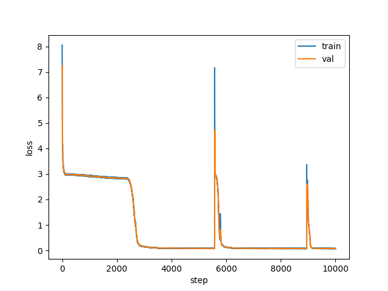

# Transformer in numpy.

Transformer (from the paper [Attention is all you need](https://arxiv.org/abs/1706.03762)) written from scratch in numpy with manual backprop cuz why not.
This is not really meant to be used for anything serious as it was only written for a meme and runs on the CPU and is thus quite slow (although everything is fully vectorized in numpy so it's not that slow either😎).

## How does it work?

As there is no autograd functionality present in numpy, all gradients are manually backpropagated.
To make my life a bit easier, I use modules, which are similar to interface used in `pytorch.nn`.
But instead only implementing `forward()` in a layer, you need to implement `backward()` as well :).
Here's the implementation of linear layer, for example ([src]("src/nn/layers/basic.py")):

```py
class Linear(Module):

    def __init__(self, in_chan, out_chan, bias=True):
        super().__init__()
        self.W = Parameter(2*np.random.rand(in_chan, out_chan)-1)
        self.b = Parameter(2*np.random.rand(1, out_chan)-1) if bias else None
        self.mm = MatMul()

    def forward(self, input):
        return self.mm([input, self.W.data]) +\
            (self.b.data if self.b is not None else 0)
    
    def backward(self, next):
        d_X, d_W = self.mm.backward(next)
        # accumulate over batch dims
        self.W.grad += d_W.reshape(-1, *self.W.grad.shape).sum(axis=0)
        if self.b:
            # accumulate over batch and feature dims
            self.b.grad += next.reshape(-1, *self.b.grad.shape).sum(axis=0)
        return d_X
```

Unlike Pytorch, however, saving calculations for efficient backprop are saved/handled in layers directly, without any ctx.
For example, in softmax backprop you use the result of forward in backward to save calculations, so reusing a layer with no parameters is not possible here.
That is why starting backprop is a bit different:

```py
model.backward(loss.backward())
```

Otherwise, the interface is pretty similar:

```py
# init model, loss optimizer
model = Transformer(...)
loss  = CategoricalCrossentropy()
optim = Adam(model.parameters(), learning_rate=1e-5, ...)

# train loop
for s in range(steps):
    # zero the gradients
    optim.zero_grad()

    # forward pass
    x_enc, x_dec, y = generate_batch(batch_size, block_size, train_set)
    y_pred = model([x_enc, x_dec])
    l = loss.calculate(y, y_pred)
    history["train"].append(l)

    # backward + optimization step
    model.backward(loss.backward())
    optim.step()
```

## Does it run?

Yes ... I guess?

Looking at loss curves in [train example]("src/train.ipynb"), the losses seem to be decreasing, although the validation loss is kinda suspect (a bit too similar to train🤔; also no clue about the spikes).



Here is the generated text, when trained on [tiny shakespeare](https://raw.githubusercontent.com/karpathy/char-rnn/master/data/tinyshakespeare/input.txt) (from [`train.ipynb`]("src/train.ipynb")).

```
seed tokens:           | t'st on many a thousand grains t

sampling predicted:    | hoh shoor atins, ich the mpeit thatecket dethat hi whiuech wooy slertean: dow than's te! hheem ges y

greedy:                | ou the the the the the the the the the the the the the the the the the the the the the the the the t
```


## If you really really want to run

Install numpy:

`pip install numpy`

Optionally, to run train example notebook:

`pip install matplotlib ipykernel`

Download tiny shakespeare dataset([link](https://raw.githubusercontent.com/karpathy/char-rnn/master/data/tinyshakespeare/input.txt)), put it in `data/resources/saved_datasets/tiny_shakespeare.txt` and enjoy wasting your time away watching the funny loss number go up and down in the [train example]("src/train.ipynb").

## TODO

* I verified backprop using finite differences, but the code is currently too messy to be included :) So uuhh trust?

* Dropout is implemented, but the whole framework needs to be adapted for it, because it is currently impossible to test due to its randomness.

* Model saving and loading.

* ...